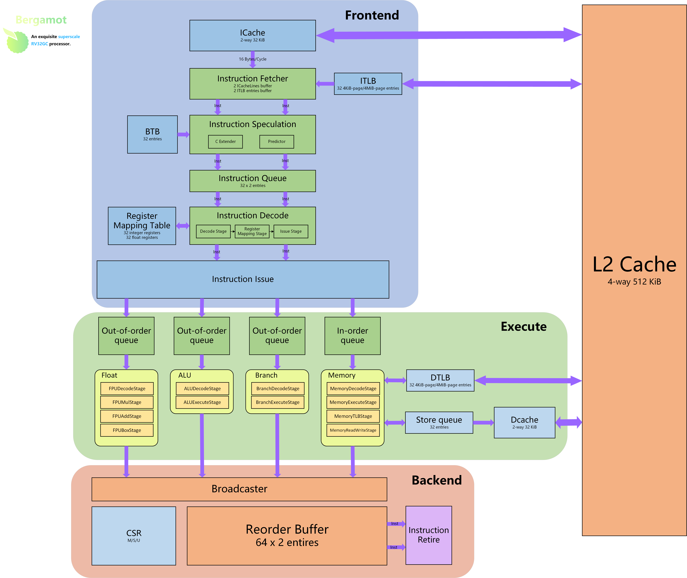

# Bergamot

A simple superscalar RV32GC processor.

Bergamot has ALL the structures of a basic superscalar pipeline:

- Multilevel, dynamic and 2-way superscalar pipeline.
- 4-way parallel sub pipelines for instruction execution.
- Branch prediction.
- L1 (I/D) & L2 cache.
- RISC-V RV32GC architecture.
- Support mainstream [Linux](https://github.com/torvalds/linux) operating system.
- Interrupts and memory-mapped I/O system.
- Support AXI bus protocol, free connection of peripherals.
- Running on FPGA.

And is trying to maintain simplicity as much as possible.

## Architecture

The Bergamot is a simple superscalar RV32GC RISC-V core written in the [Chisel](https://chisel.eecs.berkeley.edu/) hardware construction language.
Its predecessor is the [LLTRISCV](https://github.com/LoveLonelyTime/LLTRISC-V) (5-stage pipeline RV32I RISC-V core).
This project aims to develop a relatively simple and high-performance general-purpose RISC-V superscalar processor design, which can be used for teaching and research.

### Instruction fetch

Bergamot can concatenate two instruction-cache lines at a time, which enables C extensions.
The maximum instruction throughput is 2 instructions (16/32 bits) / cycle.

Bergamot also has customizable branch prediction components.
The default implementation is 2-bit status FSM improving branch hit rate.

### Register renaming and ROB

Bergamot uses 2-way register renaming and can remap 6 general-purpose registers at once.
Register renaming components writes remapping information to ROB.
And send result through data broadcast after the instruction execution is completed.
The maximum renaming instructions depends on the size of the ROB and can be freely configured by the user.

### Pipeline

Bergamot has a 2-way instruction issuing structure, which can issue two different types of instructions within a single cycle.
Meanwhile, it has four sub pipelines for instruction execution:

- ALU: Execute ALU instructions.
- Branch: Execute branch instructions to accelerate the execution of branch instructions.
- Memory: Execute memory access instructions.
- Float: Execute floating-point calculation instructions.

For each execution pipeline, Bergamot can adopt different instruction scheduling strategies.
For example, if there is no requirement for the order of instructions, an out-of-order strategy can be adopted.
This allows users to freely add functional pipelines.

### Retire

In order to match the 2-way superscalar, Bergamot can retire 2 instructions at a time.
Retired instructions will update the status of the core.

### Memory model

According to the RISC-V specification, Bergamot also follows the RVWMO memory model.
For memory read and write, it is sequential. But it has a store queue to improve write cycles.
Therefore, Bergamot allows for read and write structures with out of order.

Bergamot also has an instruction-cache, an data-cache as the L1 cache.
And a shared cache within the core as the L2 cache.
The implementation of caching can also be freely configured, depending on the type of device (FPGA/ASIC) you are using.

Finally, the core system bus uses [ARM® AMBA® AXI Protocol](https://developer.arm.com/Architectures/AMBA).

## Future and contribution

Up to now, the implementation of Bergamot is not yet very complete.
For example, there is no cache consistency protocol and a spurious atomic instructions implementation.
This constrains the multi-core feature of Bergamot.

In the future, we will further improve the performance of Bergamot and its multi-core adaptation.
If you are interested in this project, welcome to pull requests or contact the repository owner.
